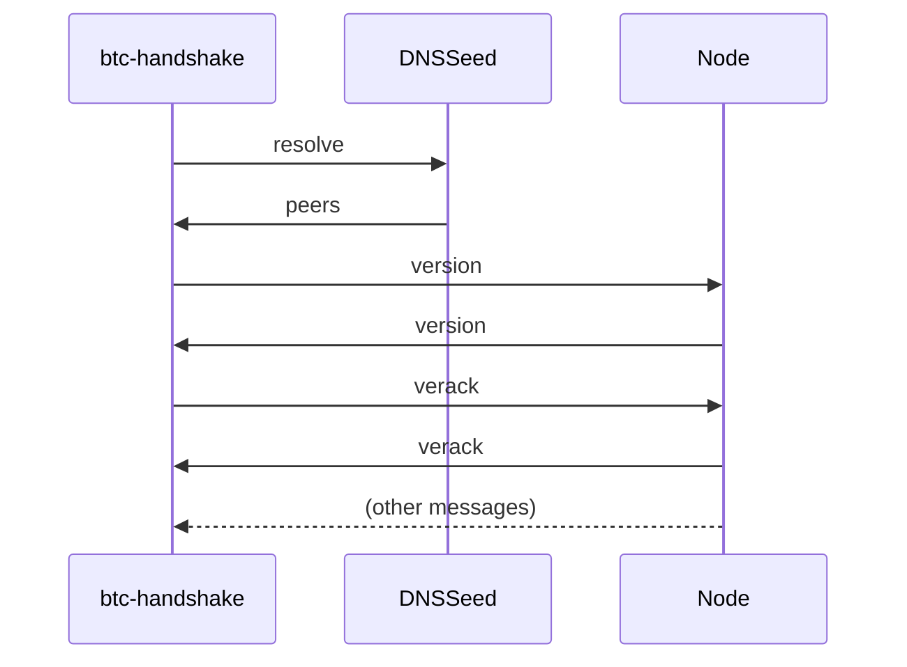

# Bitcoin Handshake

A PoC implementation of the Bitcoin handshake, performed between two nodes.
To simplify connecting to nodes, the implementation takes a [DNS seed](https://btcinformation.org/en/glossary/dns-seed) and gets a list of nodes to connect to and perform the handshake, as shown in the diagram below.



## Description

The code is split into two parts, the library containing the data structures relating to the
protocol, and a CLI tool to actually perform the handshake.

## Usage

```
Usage: btc-handshake [OPTIONS] <DNS_SEED>

Arguments:
  <DNS_SEED>  Bitcoin DNS seed domain

Options:
  -p, --port <PORT>        Target's TCP port [default: 8333]
  -t, --timeout <TIMEOUT>  Handshake timeout, in seconds [default: 5]
  -n, --network <NETWORK>  Target network [default: mainnet] [possible values: mainnet, testnet, testnet3, signet]
  -h, --help               Print help
```

### Example

```
$ btc-handshake seed.bitcoin.sipa.be.

2024-02-22T19:27:28.069121Z  INFO btc_handshake: Resolving DNS seed: seed.bitcoin.sipa.be.:8333
2024-02-22T19:27:28.193436Z  WARN version{network=Mainnet address=88.198.57.103:8333}: btc_handshake: received version (70015) which is lower than the currently implemented one (70012) trying to proceed
2024-02-22T19:27:28.604618Z  WARN verack{network=Mainnet}: btc_handshake: server skipped verack message
2024-02-22T19:27:33.076413Z  WARN btc_handshake: command mismatch: expected verack got Ok("sendcmpct\0\0\0")
2024-02-22T19:27:33.076653Z  WARN btc_handshake: failed to fill whole buffer
2024-02-22T19:27:33.076683Z  WARN btc_handshake: command mismatch: expected verack got Ok("sendcmpct\0\0\0")
2024-02-22T19:27:33.076711Z  WARN btc_handshake: command mismatch: expected verack got Ok("sendheaders\0")
2024-02-22T19:27:33.076736Z  WARN btc_handshake: command mismatch: expected verack got Ok("sendheaders\0")
2024-02-22T19:27:33.076760Z  WARN btc_handshake: command mismatch: expected verack got Ok("sendcmpct\0\0\0")
2024-02-22T19:27:33.076788Z  WARN btc_handshake: command mismatch: expected verack got Ok("sendcmpct\0\0\0")
2024-02-22T19:27:33.076811Z  WARN btc_handshake: command mismatch: expected verack got Ok("sendheaders\0")
2024-02-22T19:27:33.076834Z  WARN btc_handshake: command mismatch: expected verack got Ok("sendcmpct\0\0\0")
2024-02-22T19:27:33.076860Z  WARN btc_handshake: failed to fill whole buffer
2024-02-22T19:27:33.076884Z  WARN btc_handshake: deadline has elapsed
2024-02-22T19:27:33.076904Z  WARN btc_handshake: command mismatch: expected verack got Ok("sendheaders\0")
2024-02-22T19:27:33.076927Z  WARN btc_handshake: command mismatch: expected verack got Ok("sendcmpct\0\0\0")
2024-02-22T19:27:33.077164Z  WARN btc_handshake: command mismatch: expected verack got Ok("sendheaders\0")
2024-02-22T19:27:33.077270Z  WARN btc_handshake: command mismatch: expected verack got Ok("sendcmpct\0\0\0")
2024-02-22T19:27:33.077295Z  WARN btc_handshake: command mismatch: expected verack got Ok("sendheaders\0")
2024-02-22T19:27:33.077318Z  WARN btc_handshake: command mismatch: expected verack got Ok("sendcmpct\0\0\0")
2024-02-22T19:27:33.077342Z  WARN btc_handshake: command mismatch: expected verack got Ok("sendcmpct\0\0\0")
2024-02-22T19:27:33.077366Z  WARN btc_handshake: command mismatch: expected verack got Ok("sendcmpct\0\0\0")
2024-02-22T19:27:33.077390Z  WARN btc_handshake: command mismatch: expected verack got Ok("sendcmpct\0\0\0")
2024-02-22T19:27:33.077506Z  INFO btc_handshake: finished with 5 SUCCESS & 20 FAILED
```

As we can see, some clients will skip the `verack` by sending an empty buffer (marked by `server skipped verack message`),
other clients will ignore the `verack` and start sending other messagess straight away.

### DNS Seeds

Here you can find a list of seeds the official Bitcoin node will attempt to resolve.
You can find the list on [bitcoin/bitcoin](https://github.com/bitcoin/bitcoin/blob/1ac627c485a43e50a9a49baddce186ee3ad4daad/src/kernel/chainparams.cpp#L129-L142).

```
seed.bitcoin.sipa.be.
dnsseed.bluematt.me.
dnsseed.bitcoin.dashjr.org.
seed.bitcoinstats.com.
seed.bitcoin.jonasschnelli.ch.
seed.btc.petertodd.net.
seed.bitcoin.sprovoost.nl.
dnsseed.emzy.de.
seed.bitcoin.wiz.biz.
```
